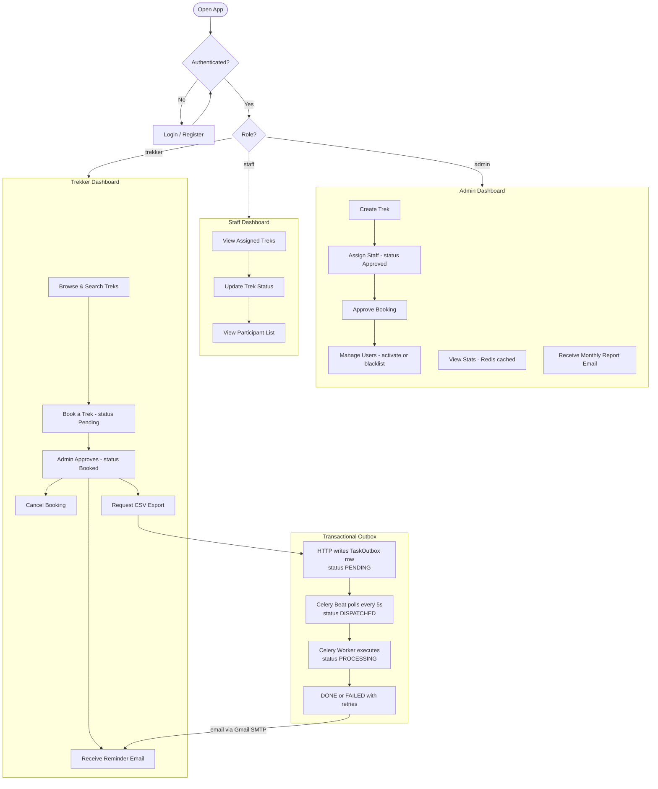

# HimTrek — Trekking Management Platform

HimTrek is a production-ready trekking management platform that coordinates **Admins**, **Trek Staff**, and **Trekkers**. It is built on a highly reliable asynchronous backbone featuring a Transactional Outbox Pattern to guarantee message/task delivery, coupled with robust caching and structured logging.

---

## Technical Highlights

- **Reliable Async Operations:** Implements the **Transactional Outbox Pattern** to ensure background tasks (like CSV exports and reminder emails) are never lost during broker outages or API crashes.
- **Role-Based Workflows:** Distinct permissions and interface flows for Administrators, Assigned Trek Staff, and Trekkers.
- **Performance Optimized:** TTL-based Redis caching for heavy endpoints (trek lists, admin dashboards) with automated invalidation.
- **Robust Observability:** Module-level centralized logging using rotating file handlers and standard console outputs.

---

## User & Asynchronous Flow



---

## The Transactional Outbox Pattern

In standard setups, an API endpoint commits a record to the database and immediately calls `task.delay()`. If the message broker (Redis) is down, or if the network hiccups right after the DB commit, the task is lost forever.

HimTrek resolves this:
1. **Atomic Write:** The Flask endpoint inserts the database records (e.g. Booking) and a `TaskOutbox` record (marked `PENDING`) in the *same* database transaction.
2. **Scheduler Dispatch:** A periodic Celery Beat job (`process_outbox`) polls the `TaskOutbox` table every 5 seconds, locking pending tasks (`with_for_update(skip_locked=True)`) and routing them to Celery.
3. **Execution & Audit:** Celery workers process the jobs and update the outbox task status to `DONE` or `FAILED`. If a task fails, Celery retries it with an exponential backoff.

---

## Prerequisites

- **Python 3.10+**
- **Node.js 18+**
- **Redis Server** running locally (if running dev environment outside Docker)

---

## Setup & Configuration

Create a `.env` file in the root directory:

```env
SECRET_KEY=your-flask-secret
JWT_SECRET_KEY=your-jwt-secret

REDIS_URL=redis://localhost:6379/

MAIL_SERVER=smtp.gmail.com
MAIL_PORT=587
MAIL_USERNAME=your-email@gmail.com
MAIL_PASSWORD=your-app-password
MAIL_DEFAULT_SENDER=your-email@gmail.com

ADMIN_EMAIL=admin@himtrek.com
ADMIN_PASSWORD=admin123
ADMIN_USERNAME=admin

LOG_LEVEL=INFO
```

---

## How to Run

### Option A: Local Dev (Using Makefile)

First, set up your virtual environment and dependencies:
```bash
make install
```

Start the backend services in three separate terminals:
```bash
make api       # Flask API Server (port 5000)
make worker    # Celery Worker Process
make beat      # Celery Beat Scheduler
```

Then run the Vue frontend:
```bash
cd frontend
npm install
npm run dev    # Vue Frontend (port 5173)
```

---

### Option B: Dockerized Backend

To run the Flask backend, Celery worker, and Celery beat inside Docker containers while preserving database state and connecting to your host's Redis:

1. **Map the host gateway** (Linux only, so `host.docker.internal` resolves locally):
   ```bash
   echo "127.0.0.1 host.docker.internal" | sudo tee -a /etc/hosts
   ```
2. **Launch with Make:**
   ```bash
   make build     # Build Docker images
   make up        # Start API, worker, and beat containers
   ```
3. **Other helpful Docker commands:**
   ```bash
   make logs      # Tail container logs
   make down      # Stop containers
   make clean     # Stop containers and remove volumes (re-seeds SQLite DB)
   ```
