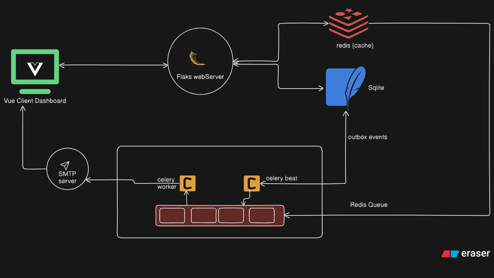

# HimTrek

HimTrek is a web-based Trekking Management Application that connects Admins, Trek Staff, and Trekkers on one platform. Admins create and manage trek routes, assign staff, and monitor bookings; Staff handle slot availability and trek status updates; Trekkers can browse, search, and book treks, track their booking history, and get automated reminders before their trip.

## system design



### Start up guide

#### 0) Setup

```bash
    # clone the repo
    git clone git@github.com:SXsid/Trekking-Management-Application---V2.git
```

```bash
    # put you .env at root
    touch .env
```

#### 1) Start The Webserver

```bash
    #move and active the enviornment
    cd backend
    python -m venv venv
    source venv/bin/activate #for linux
```

```bash
    # install hte depnecy
    #start the server


```
